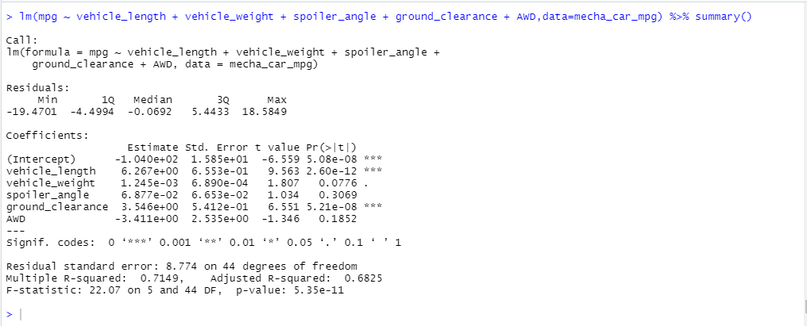
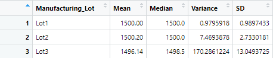
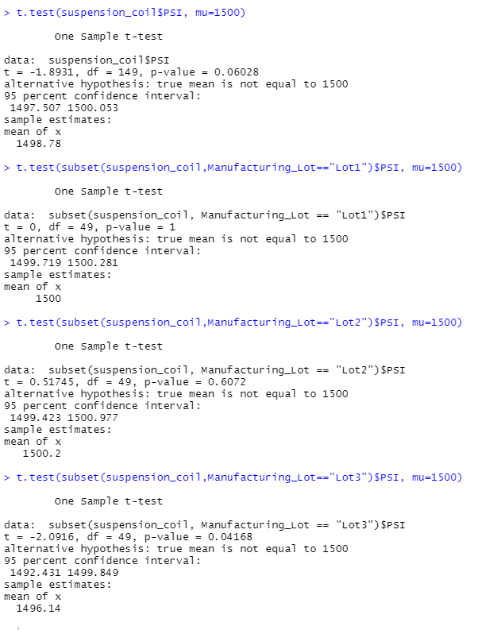

# MechaCar_Statistical_Analysis

## Linear Regression to Predict MPG

Based on the data in MechaCar_mpg.csv, Vehicle length and ground clearance both appear to have a greater impact on vehicle mpg than one could expect based on random chance. As the null hypothesis states that none of the selected variable would provide a non-random amount of variance, it can be rejected, and the slope is determined to be non-zero. While vehice length and ground clearance are both statistically unlikely to be impacting mpg to the extent they are by random chance, the Intercept also has a large P>|
t| value, and the r-squared implies a definite connection, but not a very storng one. Both of these facts imply that there are other factors impacting mpg not captured in the data. While we could make a prediction for mpg based on the captured variables, it is likely only valuable as a 'ballpark' estimate.

## Summary Statistics on Suspension Coils

Overall, it appears that the suspension coils are within design specifications, which dictate that variance cannot exceed 100 PSI.

However, upon closer inspection, we see that Lot3 exceeds the variance specifications for the MechaCar.

## T-Tests on Suspension Coils

As a whole, the full population of suspension coils seems unlikely to have its true mean at 1500 PSI, though the number is within the 95% Confidence Interval. When we drill down to each of the lots, however, we again find that the defective Lot3 is driving much of the variance. Lot1 and Lot2 both seem to confirm the the null hypothesis, with true means of 1500 quite likely. Lot3, however, does not have 1500 within the 95% CI for its true mean.

## Study Design: MechaCar vs Competition

Based on the prototype data provided for the linear regression to predict mpg, the MechaCar could be made to run 80 miles to the gallon. If this can be made consistently, it would be a metric likely to show the MechaCar in a favorable light compared to the competition and thus is worth leveraging. In order to properly illustrate the strength of the MechaCar in this metric, we should obtain highway and city mpg ratings for various vehicles on the market in the same class that we intend to make the MechaCar, in addition to the same data for the MechaCar. The alternative hypothesis that we will test is that the MechaCar has higher city and highway mpg than the population of vehicles as a whole. In order to confirm (or reject) our alternative hypothesis, we will run a one sample t-test, using the MechaCar numbers as the sample against the population of all vehicles.

